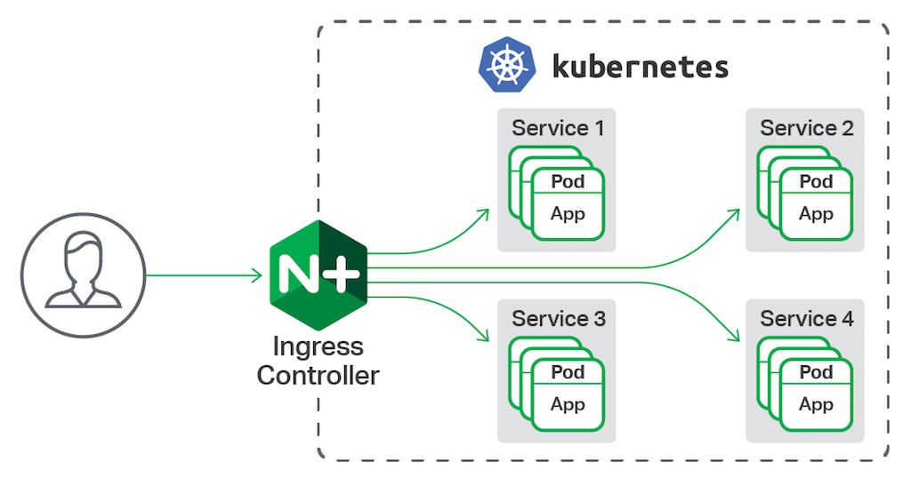

Tipos de Instalação do Kubernetes
=================================

* **Manual**
* **Minikube**
* **Cloud**:
  - Google: GKE
  - Azure: AKS
  - AWS: EKS

Minikube
========
O Minikube é um Programa para gerenciamento de máquinas virtual que permite a manipulação do Kubernetes com todos os componentes já preparados. Porém, é necessário frisar que o Minikube é utilizado apenas em ambiente de Laboratório, ou seja, _jamais deve ser usado em produção_.

Para utilizar o Minikube é necessário o **kubectl** ou Kube Control para que seja possivel gerenciar o Kubernetes.

A instalação do Minikube e do Kube Control podem ser feitas conforme abaixo:

* Instalação do Kube Control:
```bash
bash << EOF
curl -LO https://storage.googleapis.com/kubernetes-release/release/$(curl -s https://storage.googleapis.com/kubernetes-release/release/stable.txt)/bin/linux/amd64/kubectl
chmod +x kubectl
mv kubctl /usr/local/bin/
EOF
```

> Reference:  https://kubernetes.io/docs/tasks/tools/install-kubectl/#install-kubectl-on-linux

* Instalação do MiniKube
```bash
bash << EOF
curl -Lo minikube https://storage.googleapis.com/minikube/releases/latest/minikube-linux-amd64
chmod +x minikube
mv minikube /usr/local/bin/
EOF
```

> Projeto MiniKube: https://github.com/kubernetes/minikube/releases

* Validando Versão do Minikube
  ```bash
  minikube version
  ```

* Verificando Opções Validas
  ```bash
  minikube help
  ```

* Iniciando o MiniKube
  Quando iniciarmos o Minikube será iniciado um pequeno ambiente Kubernetes:
  ```bash
  minikube start
  ```

Após a finalização da iniciliazação do Minikube, podemos iniciar as verificações básicas no cluster de Kubernetes:

Kubernetes - Comandos Iniciais
------------------------------

#### Coleta de Informações
Primeiramente vamos coletar alguns informações básicas do Cluster.
De inicio podemos ver o **cluster-info** com o seguinte comando:

```bash
kubectl cluster-info
```

A partir desse momento é importante entendermos como funciona a sintaxe de comandos do Kubernetes, já que ela está totalmente relacionada as interações com seus objetos.

Em sua maioria os comandos do Kubernetes funcionando com a informação de um **VERBO** (operação que será realizada) mais um **OBJETO** (componente do Kubernetes que receberá a ação) e caso necessário **FLAGS** (opções adicionais)

```bash
kubectl [VERB] [OBJECT] [NAME] [flags]
kubectl get node
```

Dessa forma, após listar os nodes é possivel adquirimos mais informações sobre um node especifico utilizando a operação **describe**

```bash
kubectl describe nodes [NAME_NODE]
```

Outra operação comum no Kubernetes é o **get**. Com ele é possivel listar os objetos criados no ambiente, por exemplo, ver quais são os **namespaces** criados:

```bash
kubectl get namespaces
```

Alguns objetos podem ser abreviados no comando do Kube Control, sendo assim a listagem de namespace poderia ser reduzida da seguinte maneira:

```bash
kubectl get ns
```

Dessa forma, assim como fizemos com os nodes, é possivel obter mais informações de um determinado namespace com o seguinte comando:

```bash
kubectl describe ns [NAME_NAMESPACE]
```

Com isso, podemos fazer pequenas avaliações para os principias objetos:
* Verificando Pods
  ```bash
  kubectl get pods
  ```
* Verificando Pods por Namespace
  ```bash
  kubectl get pods --namespace kube-system
  ```
  Há dois pontos de atenção nesse caso:
  - É possivel abreviar a opção `--namespace` por **-n**
  - E a saida desse comando irá apresentar os pods que mantém o sistem do Kubernete que, em suma, são os componentes necessário para o funcionamento Cluster.
* Verificando Deployment do NameSpace _kube-system_
  ```bash
  kubectl get deployments -n kube-system
  ```
* Verificando Service
  ```bash
  kubectl get svc -n kube-system
  ```
  Caso seja necessário obter um saida mais completa podemos usar a opção **-o** que permite estender o _output_ do comando para mais informações ou outros formatos de saída.
  ```bash
  kubectl get service -o yaml
  kubectl get deploy -o wide
  ```
  Por fim, é possivel também fazer a verificação dos objetos de todos os namespaces, como no exemplo abaixo:
  ```bash
  kubectl get pods -A
  kubectl get deploy --all-namespaces
  ```

Criando Objetos no Kubernetes - CommandLine
-----------------------------
De forma geral, quase todos os objetos no Kubernetes podem ser criados via linha de comando ou via arquivo YAML.

A criação via arquivo YAML é a mais comum de ser utilizada, principalmente pelo fato de ser possivel versionar as configurações.

Porém é interessante entender como criar alguns Objetos via linha de comando.
Isso é uma boa prática para entender seu funcionamento, além de, em alguns momentos, ajudar na criação dos arquivos YAML.

#### Criando POD
Com isso, para que a gente possa criar um Pod é necessário executar o seguinte comando:

```bash
kubectl run nginx --generator=run-pod/v1 --image nginx:alpine
```

Com o POD criado podemos executar comandos para validar o container criado e suas informações.

* Verificar Criação do POD
  ```bash
  kubectl get pod
  ```

Neste caso o nosso POD tem apenas um container que está utilizando a imagem _nginx:alpine_ e podemos manipular o container com o Kube Control.
* Execução de Comandos no Container
  ```bash
  kubectl exec -ti NAME_POD COMMANDS
  kubectl exec -ti nginx -- nginx -v
  ```
  Podemos perceber que o execução de comandos em um container no Kubernetes é realizado da mesma maneira de um ambiente Docker, sendo possível até acessar o container:
  ```bash
  kubectl exec -ti nginx sh
  ```
  Caso no POD exista mais de um container é possivel executar comandos ou acessar o container passando seu nome com a opção `--container` ou, sua opção _sort_, `-c` conforme a sintaxe abaixo:
  ```bash
  kubectl exec -c NAME_CONTAINER -ti NAME_POD COMMAND
  ```
* Validando Conexão ao NGINX
  Devido a utilização do Minikube, temos que executar os comandos no node diretamente por ele.
  Com isso, primeiro vamos identificar qual o IP do container
  ```bash
  kubectl get pod -o wide
  ```
  E após isso podemos realizar um requisão na porta 80 do container:
  ```bash
  minikube ssh curl IP_CONTAINER
  ```
* Vendo Logs do Container
  Após realizar a requisição no serviço web do container, podemos avaliar os logs gerados da seguinte maneira:
  ```bash
  kubectl logs NAME_POD
  ```
  Caso eu não queira mais manter esse pod, posso realizar sua exclusão com o seguinte comando
  ```bash
  kubectl delete pod NAME_POD
  ```
  É importante ressaltar que a exclusão dos objetos do Kubernetes segue a seguinte sintaxe:
  ```bash
  kubectl delete OBJECT NAME_OBJECT
  ```

#### Criando DEPLOYMENT
O Deploymente é o objeto de alto nível e também pode ser criado via _command line_.

* Criar Deployments
  ```bash
  kubectl create deploy httpd --image=httpd:alpine
  ```
  Após a criação do Deploy é possivel visualiza-lo utilizando o **get deploy**
  ```bash
  kubectl get deploy
  ```
  Como o deploy está inteiramente associado a um pod é possivel visualizar quantos pods forma criados com esse Deploy.
  ```bash
  kubect get pod
  ```
  Podemos ver que ele criou apenas um pod.
  O Deployment faz a gerencia tanto de Pod, Réplicas da aplicação e estratégia de aplicação.
  É possivel, mesmo criando o deploy via command line, ver como foram descritas as suas configurações:
  ```bash
  kubectl get deployment -o yaml
  ```
  Com isso, podemos validar que via command line o Deploy é criado com apenas uma réplica.
  Para que, sem um arquivo yaml, seja possivel aumentar a quantidade de replicas, podemos usar o seguinte comando:
  ```bash
  kubectl scale deploy NAME_DEPLOY --replicas=3
  ```
  Dessa forma, a aplicação será escalada 3 vezes utilizando o templante de pod baseado na imagem do Apache (httpd:alpine).
  Podemos confirmar o aumento das replicas da seguinte forma:
  ```bash
  kubectl get deploy
  kubectl get pod
  ```

**SERVICE**

Após realizar o _Deployment_ devemos começar a pensar em como vamos realizar o acesso da aplicação. Nesse momento é válido entender em qual estágio a aplicação está: Produção, Testes, Homologação, etc.

Já que para cada um dessas fases podem ser acessadas de maneiras diferentes dependendo da estrátégia da empresa.

Os tipos de Services que podemos usar são os seguintes:

Tipos de Services | Descrição
------------------|----------
ClusterIP | Expôem o Serviço para um IP Interno do Cluster
NodePort | Expõe o Serviço para cada IP dos Nodes e em uma Porta Estatica
LoadBalancer | Expôe o Serviço Externamente (Cria ClusterIP e NodePort Automaticamente)
ExternalName | Mapeia o Serviço para um DNS (Necessário o CoreDNS)
> Referência: https://kubernetes.io/docs/concepts/services-networking/service/

Neste primeiro momento, assim como os outros objetos, vamos realizar as configurações via command line.

* Criando Service para o Deploy
  Vamos utilizar o Deploy anterior para expor sua porta e podermos acessar a aplicação de dentro do cluster.
  ```bash
  kubectl expose deploy NAME_DEPLOY --port 80
  ```
  Neste caso, por padrão o service será criado com o tipo _ClusterIP_ e a porta 80 será exposta.
* Visualizando Service
  ```bash
  kubectl get services
  ```
* Acessando Aplicação.
  Para que seja possivel acessar a aplicação precisamos novamente do Minikube, já que o ClusterIP só funciona para IP Internos do Cluster.
  Com o seguinte comando, conseguimos acessar o cluster e executar um requisão no IP criado pelo Service:
  ```
  minikube ssh curl IP_SERVICE`
  ```

Dessa forma fazemos o acesso apenas de dentro do Cluster. Para que seja possivel o acesso externo podemos usar o tipo NodePort na criação do service.
* Deletando Service
  ```bash
  kubectl delete svc NAME_SERVICE
  ```
* Alterando Tipo do Service
  ```bash
  kubectl expose deploy NAME_DEPLOY --port 80 --type NodePort
  ```
* Verificando Service Criado com NodePort
  ```bash
  kubectl get svc
  ```
> Após configurar o Service como NodePort é liberada, para acesso, uma **porta maior que 30000** que será redirecionada para a porta 80 do container no POD.

Com o Service criado agora podemos acessar a aplicação pelo IP da máquina virtual. Para isso temos que saber qual o IP utilizado pelo Minikube
* Pegando IP do Minikube
  ```bash
  minikube ip
  ```
* Acessando Aplicação
  ```bash
  curl IP_MINIKUBE:PORT_NODEPORT
  curl 192.168.99.100:31000
  ```
  Sendo assim, agora é possivel realizar o acesso via qualquer Browser.

Criando Objetos no Kubernetes - YAML
-------------------------------------

A forma mais comum de criar objetos no Kubernetes é utilizando arquivos YAMLs.
O YAML está se tornando cada vez mais popular e sendo usado para inúmeras formas de serializar informação com o objetivo de ser amigavel ~~(objetivo nem sempre alcançado)~~

Em suma a maioria dos Objetos tem os seguintes campos como obrigatórios:
* **apiVersion**: Versão do Kubernetes API para criar os objetos
* **kind**: Tipo do Objetivo (Pod, Service, Deployment, etc.)
* **metadata**: Informações para identificar o objeto no ambiente Kubernetes (nome, namespace, etc.)
* **spec**: Quais as especificações desejadas para o objeto. Em outras palavras o estado de criação do seu objeto.

Com isso, nesse primeiro momento, vamos entender a utilização do YAML replicando a criação dos Objetos que criamos apenas via _command line_

### Criando POD com YAML

Vamos criar o arquivo pod-web.yml com o seguinte conteúdo:
```yml
apiVersion: v1
kind: Pod
metadata:
  name: pod-web
spec:
  containers:
  - name: apache
    image: httpd:alpine
    ports:
    - containerPort: 80
```

Neste caso além dos campos obrigatórios temos as especificações dos containers que serão criados no POD.
* **containers**: Flag de inicialização da lista de configurações dos containers.
  - **name**: Configuração do nome do container.
  - **image**: Imagem que será utilizada para criar o container.
  - **ports**: Lista de portas para expor no container.
  - **containerPort**: Porta que o container irá expor.

Após a criação do arquivos, podemos implementar o POD da seguinte maneira:
```bash
kubectl create -f pod-web.yml
```

### Criando DEPLOYMENT com YAML

Agora que já entendemos como funciona a criação de um YAML para gerenciar objetos no Kubernetes, podemos criar um Deployment. É percepitivel que o conteúdo seguinte arquivo (deploy-nginx.yml), contém um grau de complexidade maior em relação ao POD. Sendo assim, vamos cria-lo:
```yml
apiVersion: apps/v1
kind: Deployment
metadata:
  name: deploy-nginx
  labels:
    objeto: deploy-nginx
spec:
  replicas: 3
  selector:
    matchLabels:
      app: pod-nginx
  template:
    metadata:
      labels:
        app: pod-nginx
    spec:
      containers:
      - name: nginx
        image: nginx:alpine
        ports:
        - containerPort: 80
```
Antes de entendermos cada campo é necessário ter o entendimento sobre **Labels** e **Selectors**

* **_Labels_**:
  - São conjuntos de chave x valor para agrupar objetos no kubernetes utilizados, geralmente, na organização e chamadas dos objetos.
  - É possivel adicionar Label via command line da seguinte forma:
    ```bash
    kubectl label objetc NAME key=value
    kubectl label pod pod-web server=web
    ```
    As labels de cada objeto podem ser visualizada com a flag **--show-labels**, conforme o exemplo abaixo:
    ```bash
    kubectl get pod --show-labels
    ```
* **_Selector_**:
  - Utilizado para Selecionar Objetos baseados em Labels, ou seja, funciona como um filtro que permite associar e organizar objetos que tenham um Label especifica.

Sendo assim, é possivel observar com mais clareza cada campo do Deployment:
* **labels**: Inicia a informação de metadata para criar uma label para o objeto.
  - **objeto: deploy-nginx**: Label para identificar o Deployment.
* **replicas**: Quantidade de PODs que serão criados a partir de um template.
* **selector**: Cria um metodo de selação para associar objetos ao Deployment
  - **matchLabels**: Definir que os seletores irão utilizar Labels.
    - **app: pod-nginx**: Label que identifica os PODs que serão manipulados pelo Deploy e pelo ReplicaSet.
* **template**: Inicialização as configurações de um template de criação de Pods
  - **metadata**: Informações dos PODS criados a partir do template
    - **labels**: Inicia a informação de metadata para criar uma label para o objeto (Nesse caso do POD)
      - **app: pod-nginx**: Label definida para identificar os PODS.
* **spec**: Inicia a definição de especificações para criação do POD
  - **containers**: Inicia as configurações para criação do containers

Criando o Deploy via Arquivo:
```bash
kubectl create -f deploy-nginx.yml
```

### Criando SERVICE com YAML

Definida a criação de Deployment, podemos agora gerar um arquivo (service-nginx.yml) de Service.
```yml
apiVersion: v1
kind: Service
metadata:
  name: service-nginx
spec:
  selector:
    app: pod-nginx
  type: ClusterIP
  ports:
  - port: 80
    targetPort: 80
```
Criando o Service via Arquivo:
```bash
kubectl create -f service-nginx.yml
```

Faça os teste de acesso pelo ClusterIP
```bash
kubectl get svc
minikube ssh curl CLUSTER_IP
```
Depois vamos editar o service para utilizar NodePort:
```bash
kubectl edit service service-nginx
```
Mudaremos o tipo de Service e adicionaremos uma nova opçao abaixo de _targertPort_ conforme abaixo:
```yml
type: NodePort #Alteração do Tipo de Service
ports:
- port: 80
  targetPort: 80
  nodePort: 32000 #Inclusão de uma porta especifica para o Node Port
```
Assim, podemos testar o acesso na 32000:
```bash
minikube ip
curl MINIKUBE_IP:32000
```

INGRESS
-------
Mesmo com um service criado, ainda não conseguimos utiliza-lo para que um cliente faça o acesso em uma porta comum como, por exemplo, a porta 80.
Para resolver esse problema é nessário a configuração de um Ingress.

O Ingress trabalha com um Fluxo do qual ele ficará na frente do ambiente Kubernetes recebendo as requisiçoes e encaminhando para o Serviço distribuir entre os PODS. Conforme a imagem abaixo:



Para criar um Ingress é necessário a instalação de um Ingress Controller.
Como estamos utilizando o Minikube, só precisamos habilita-lo com o seguinte comando:
```bash
minikube addons enable ingress
```
Após isso podemos chegar que foi criado um POD no namespace kube-system do NGINX-Ingress:
```bash
kubectl get pod -n kube-system
```

Com o Pod criado é possivel fazer a criação de um ingress para podermos associar a aplicação na porta 80 e com um dominio de acesso.
Para isso criamos o arquivo ingress.yml:

```yml
apiVersion: extensions/v1beta1
kind: Ingress
metadata:
  name: ingress
spec:
  rules:
  - host: kube.192-168-99-100.nip.io
    http:
     paths:
     - path: /
       backend:
         serviceName: service-nginx
         servicePort: 80
```
Em suma os campos necessários para a criação do Ingress são os seguintes:
* **rules**: Inicialização da definição das regras para acesso via o ingress.
  - **host**: Dominio de acesso
  - **http**: Inicializa a definição do caminho para a aplicação e associação a um service.
    - **paths**: Lista de Caminhos mapeados da aplicação
      - **path**: caminho para acesso a aplicação (Ex: /, /admin, /contato)
      - **backend**: Definição do Serviço associado ao ingress.
        - **serviceName**: Nome do Service
        - **servicePort**: Porta definida no service.

Criando o Ingress:
```bash
kubectl create -f ingress.yml
```
Com isso podemos testar acessando o dominio adicionado no ingress:
```bash
curl kube.192-168-99-100.nip.io
```
Ou Acessar plelo Browser: `http://kube.192-168-99-100.nip.io`

---
