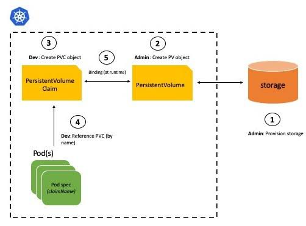
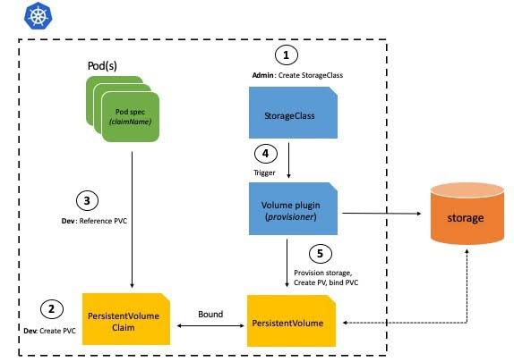

Manipulando Objetos no Cluster Kubernetes
=========================================
Com o cluster já provisionado começamos a fazer validações com Objetos mais especificos.
No laboratório apresentado neste arquivo abordaremos os seguintes topicos:
* Criando Volumes e Utilizando StorageClass
* Ingress com TLS
* Utilização de Secrets no Ambiente
* Job e CronJob

Volumes
-------
Dentro do ambiente do Kubernetes conseguimos fazer o armazenamento de informações de diferentes formas.

Kubernetes suporta inumeros tipos de Volumes, abordaremos apenas os seguintes:
* emptyDir
* hostPath
* PersistentVolume (PV) com NFS
> Volumes Suportados: https://kubernetes.io/docs/concepts/storage/volumes

#### emptyDir
Volumes do tipo emptyDir não são persistentes já sua inicialização é vazia. O emptyDir tem o seu ciclo de vida associado ao ciclo de vido do Pod, ou seja, se o Pod deixa de exister o emptyDir também será excluido.

* _Criando POD com emptyDir_
  Para a criação do emptyDir basta realizar a montagem de um volume dentro do container e fazer essa asssociação na criação do volume. Conforme descrito no arquivo **pod-emptydir.yml** abaixo:
  ```yml
  apiVersion: v1
  kind: Pod
  metadata:
  name: pod-emptydir
  spec:
  nodeName: master1
  volumes:
  - name: backup-volume
    emptyDir: {}
  containers:
  - image: nginx:alpine
    name: emptydir
    volumeMounts:
    - mountPath: /backup
      name: backup-volume
  ```
  É importante destacar, que nessa criação estamos usado a opção **nodeName** do qual faz o POD ser criado em Node especifico.
  Para a criação dos emptyDir utilizamos as seguintes opções:
  - **volumes**: Inicia as configurações de um volume no POD
    - **name**: Nome do volume
    - **emptyDir: {}**: Tipo do Volume - emptyDir

  Já dentro das opções do Container usamos:

  - **volumeMounts**: Inicializa a configuração de montagem de um volume no container
    - **mountPath**: Caminho que o volume será montado
    - **name**: Nome do volume
  Crie o Pod no ambiente:
  ```bash
  kubectl create -f pod-emptydir.yml
  ```
* _Verificando volume no Pod_
  Para validar a criação no volume dentro do POD podemos executar `dh -Th` dentro do container da seguinte forma:
  ```bash
  kubectl exec -ti pod-emptydir -- df -Th
  ```
  Além disso é possivel mapear os volumes no diretório /var/lib/kubelet/pods
  ```bash
  ls /var/lib/kubelet/pods/<HASH_POD>/volumes/kubernetes.io~empty-dir/
  ```

#### hostPath
Quando criamos um volume **hostPath** estamos criando um arquivo ou diretório diretamente no filesystem do Node e associando ele ao container dentro do Pod.

Já que o armazenamento é local, o hostPath é persistente. Pois mesmo que o POD seja excluido, a diretório ou arquivo irá continuar existindo no Node.

Em geral, é necessário que o arquivo ou diretório exista dentro do Node. Sendo assim é importante perceber que se a aplicação estiver em inúmeros Nodes cada um deles devem ter o arquivo ou diretório.

Os tipos de hostPath aceitos são os seguintes:

Tipo  | Ambiente
----- | ---------
  | O tipo "vario" é o padrão e nele não é feita nenhuma verificação.
DirectoryOrCreate  |  Verifica se o Diretório existe, caso contrario o cria.
Directory  | Diretório deve existir no Node.
FileOrCreate | Verifica se o arquivo existe, caso contrario o cria.
File | Arquivo deve existir no Node
Socket | Arquivo de Socker. Deve existir no Node
CharDevice | Character Device(Dispositivos de comunicação por character(bytes ou octetos) - Geralmente portas seriais, mouse, etc). Deve existir no Node.
BlockDevice | Block Device (Dipositivos de Bloco - HD, USB, etc). Deve existir no Node.

* Criando POD com HostPath
  Edite o arquivo pod-hostpath.yml com o seguinte conteúdo:
  ```yml
  kind: Pod
  metadata:
  name: pod-hostpath
  spec:
  nodeName: master2
  volumes:
  - name: volume-vagrant
    hostPath:
      path: /vagrant/
      type: Directory
  containers:
  - image: nginx:alpine
    name: hospath
    volumeMounts:
    - mountPath: /volume-vagrant/
      name: volume-vagrant
  ```
  ```bash
  kubectl create -f pod-hostpath.yml
  ```
  Em relação ao emptyDir há apenas a mudança da criação do Volume com o nome **hostPath** e a utilizaçao do **Type** para especificar que tipo de volume hostPath seria utilizado.

  Lembrando que adicionar o Type quando se usa o hostPath é opcional.

* Validando Volume hosPath
  ```bash
  kubectl exec -ti pod-hostpath -- df -Th
  ```

#### Volume Persistente com NFS
Dentro das recomendações, o volume persistente com um Storage é tido com a melhor opção. Dessa forma há a gerencia integral do conteúdo sem depender dos Nodes.

**PV - PersistentVolume**
O PV(PersistentVolume) é o objeto que está associado ao Storage de dados. Ou seja, esse objeto que conseguirá preparar o Volume fazendo a requisição diretamente no Storage.

**PVC - PersistentVolumeClaim**
Persistent Volume Claim é uma requisiçao de volume feita pelo usuário. De forma geral um Pod realiza a requisição de volume utilizando o PVC que faz a requisição do volume ao PV baseado em um Tamanho e Permissionamento especifico.

* Mods de Acesso do Volume(Permissionamento):

Modo | Abreviação | Descrição
---- | ---------- | ---------
ReadWriteOnce | RWO | Leitura e Escrita apenas por um Node
ReadOnlyMany  | ROX | Apenas Leitura por vários Nodes
ReadWriteMany | RWX | Leitura e Escrita por vários Nodes

Em suma, nossa laboratório seguirá o seguinte diagrama:



Sendo assim, devemos seguir os seguintes passos no nosso laboratório:
1. Implementar o NFS na máquina **balancer-storage**
2. Configurar o PV (PersistentVolume)
3. Configurar o PVC (PersistentVolumeClaim)
4. Criar um Deploy com o Volume Persistente

Então vamos iniciar.

1. **Implementar NFS**
  Vamos acessar a máquina **balancer-storage** e instalar os seguintes pacotes do NFS:
  ```bash
  apt-get install -y nfs-kernel-server nfs-common
  ```
  O proximo passo é configurar os volumes que serão utilizados no ambiente criando as pastas dos volumes:
  ```
  mkdir /srv/v{1..4}
  ```
  Com isso, podemos editar o arquivo **/etc/exports** mapeando as pastas criadas:
  ```
  /srv/v1        200.100.50.0/24(rw,sync,no_root_squash)
  /srv/v2        200.100.50.0/24(rw,sync,no_root_squash)
  /srv/v3        200.100.50.0/24(rw,sync,no_root_squash)
  /srv/v4        200.100.50.0/24(rw,sync,no_root_squash)
  ```
  Após isso basta reiniciar o servido e validar se os volumes estão sendo compatilhados
  ```bash
  systemctl restart nfs-kernel-server
  exportsfs
  ```
  Por fim, é necessário que em cada máquina seja instalado o **nfs-common**
  - master1 - master2 - master3
    ```bash
    apt-get install -y nfs-common
    ```
2. **Configurando PV**
  Podemos, então, criar o arquivo **pv.yml**:
  ```yml
  apiVersion: v1
  kind: PersistentVolume
  metadata:
    name: pv01-nfs
  spec:
    capacity:
      storage: 512Mi
    accessModes:
    - ReadWriteMany
    nfs:
      server: 200.100.50.200
      path: '/srv/v1'
  ```
  Deste arquivo devemos destacar as opção após o **spec**:
  - **capacity**: Permite definir o tamanho de capacidade do volume
    - **storage**: Especificação do tamanho. Valor é apenas informativo, já que dependendo da Solicitação o Storage prove além do informado.
  - **accessModes**: Configuração do permissionamento de leitura e escrita do volume.
    - **ReadWriteMany**: Acesso definido com Leitura e Escrita por vários nodes.
  - **nfs**: Define a utilização do NFS como Storage
    - **server**: Endereço do Servidor NFS
    - **path**: Mapeamento do caminho do volume NFS que será utilizado.

  Criando e validando a criação do PV.
  ```bash
  kubectl create -f pv.yml
  kubectl get persistentvolume
  ```
3. **Configurando PVC**
  Agora vamos criar o arquivo **pvc.yml**:
  ```yml
  apiVersion: v1
  kind: PersistentVolumeClaim
  metadata:
    name: pvc-nfs
  spec:
    accessModes:
    - ReadWriteMany
    resources:
     requests:
       storage: 256Mi
  ```
  Nesse caso, podemos ver que o PVC irá se responsabilizar pela requisição do volume, podendo definir o seu modo de acesso (accessModes) e o tamanho necessário (resource → requests → storage)
  Criando e validando a criação do PVC.
  ```bash
  kubectl create -f pvc.yml
  kubectl get persistentvolumeclaim
  ```
4. **Deploy com VolumePersistent**
  Vamos definir o arquivo **deploy-volume.yml** com o seguinte conteúdo:
  ```yml
  apiVersion: apps/v1
  kind: Deployment
  metadata:
    labels:
      app: deploy-volume
    name: deploy-volume
  spec:
    replicas: 2
    selector:
      matchLabels:
        app: deploy-volume
    template:
      metadata:
        labels:
          app: deploy-volume
      spec:
        volumes:
        - name: volume-persistente
          persistentVolumeClaim:
            claimName: pvc-nfs
        containers:
        - image: alpine
          name: alpine
          tty: true
          stdin: true
          volumeMounts:
          - name: volume-persistente
            mountPath: /var/shared-data
  ```
  ```bash
  kubectl create -f deploy-volume.yml
  ```
  - Verificando Volumes
    ```bash
    kubectl get pv
    kubectl get pvc
    ```
    É possivel ver que agora o Status do PV e do PVC é _Claim_ ou seja, ele foi requirido e associado ao Deploy com sucesso.
  - Validando Volume no Deploy
    ```bash
    kubectl exec -ti deploy-volume-<HASH_POD1> -- dh -Th
    kubectl exec -ti deploy-volume-<HASH_POD2> -- touch /var/shared-data/backup
    kubectl exec -ti deploy-volume-<HASH_POD1> -- ls /var/shared-data/
    ```
    Com isso podemos ver na máquina **balancer-volume** que a pasta /srv/v1 agora tem o arquivo chamado backup, além de configurar que os dois PODs estão compartilhando o mesmo volume.

#### Storage Class
O Storage Class é um forma de provisionar volumes de maneira dinamica. Esse tipo de objeto é utilizado, geralmente, em conjunto com ambientes em Cloud.

Não iremos conseguir provisionar volumes dinamicos em Cloud neste laboratório, mas há alguns exemplos que pode ser seguidos na Documentação do Kubernetes:
https://kubernetes.io/docs/concepts/storage/storage-classes/

De qualquer forma, podemos simular o seu funcionamento no nosso ambiente ainda utilizando o NFS.

o Fluxo do StorageClass pode ser representado na seguinte imagem:



Entendido como é o funcionamento, podemos iniciar os procedimentos:

* Criando StorageClass
  Vamos criar o arquivo **storageclass.yml** para criar o StorageClass da seguinte maneira:
  ```yml
  apiVersion: storage.k8s.io/v1
  kind: StorageClass
  metadata:
    name: hard-disk
  provisioner: kubernetes.io/no-provisioner
  volumeBindingMode: WaitForFirstConsumer
  ```
  Neste caso estamos criando um StorageClass chamado **hard-disk**, com um Pseudo-Provisionador e adicionando e definindo que o volume somente será atachado quando o primeiro POD de fato requisita-lo.
  - Criando e Validando Storage class:
  ```bash
  kubectl create -f storageclass.yml
  kubectl get storageclass
  ```
* Criando PV e PVC
  Caso estivesse configuranado em Cloud, só iriamos precisar configurar o PVC, ou seja a requisição de volume por parte do Cliente.

  Como estamos simulando o funcionamento do StorageClass, vamos fazer PV que responda as requisições para o StorageClass.

  Arquivo pv-storageclass.yml:
  ```yml
  apiVersion: v1
  kind: PersistentVolume
  metadata:
    name: pv02-nfs
  spec:
    capacity:
      storage: 1Gi
    accessModes:
      - ReadWriteOnce
    storageClassName: hard-disk
    nfs:
      server: 200.100.50.200
      path: "/srv/v2"
  ```
  Repare que é com a opção **storageClassName** que associamos o PV com o StorageClass criado anteriormente.
  ```bash
  kubectl create -f pv-storageclass.yml
  ```

  Neste caso, já podemos criar o PVC. Editando o arquivo pvc-storageclass.yml:
  ```yml
  apiVersion: v1
  kind: PersistentVolumeClaim
  metadata:
    name: pvc-sc
  spec:
    accessModes:
      - ReadWriteOnce
    resources:
      requests:
        storage: 1Gi
    storageClassName: hard-disk
  ```
  ```bash
  kubectl create -f pvc-storageclass.yml
  kubectl get pvc
  ```
  Repare que o PVC irá ficar **PENDING**, pois definimos que enquanto algum objeto não solicitar o recurso o volume não será criado.
* Criando POD com StorageClass
  Vamos agora criar o Pod que irá ter o seu volume de forma dinamica, editando o arquivo **pod-sc.yml**
  ```yml
  apiVersion: v1
  kind: Pod
  metadata:
    name: pod-storageclass
  spec:
    volumes:
    - name: cached-data
      persistentVolumeClaim:
        claimName: pvc-sc
    containers:
    - image: alpine
      name: alpine
      tty: true
      stdin: true
      volumeMounts:
      - name: cached-data
        mountPath: /var/cached-data
  ```
  ```bash
  kubectl create -f pod-sc.yml
  kubectl get pv
  kubectl get pvc
  ```
  Agora, com a requisição de volume do POD, foi criado dinamicamente o Storage e atachado ao Pod. Podendo ser validado com o comando abaixo:
  ```bash
  kubectl exec -ti pod-storageclass -- df -Th
  ```

#### Ingress com TLS
Na [Aula01](../Aula01) criamos um Ingress para acessar uma aplicação na porta 80. Neste momento vamos utilizar o Ingress para o acesso na porta 443.

Como estamos trabalhando com o Cluster, vamos ter que fazer a instalação do NGINX Ingress Controller para poder usufruir dessa função no nosso ambiente.

* **Instalação do NGINX Ingress Controller**
  Projeto: https://github.com/nginxinc/kubernetes-ingress

  Inicialmente vamos precisar clonar o repositório:
  ```bash
  bash << EOF
  apt-get install git -y
  git clone https://github.com/nginxinc/kubernetes-ingress.git
  EOF
  ```
  Após isso podemos aplicar as configurações no ambiente kubernetes:
  ```bash
  bash <<EOF
  kubectl apply -f kubernetes-ingress/deployments/common/ns-and-sa.yaml
  kubectl apply -f kubernetes-ingress/deployments/common/default-server-secret.yaml
  kubectl apply -f kubernetes-ingress/deployments/common/nginx-config.yaml
  kubectl apply -f kubernetes-ingress/deployments/rbac/rbac.yaml
  kubectl apply -f kubernetes-ingress/deployments/daemon-set/nginx-ingress.yaml
  EOF
  ```
  Validar NGINX Ingress em todos as máquinas:
  ```
  kubectl get pod -n nginx-ingress -o wide
  ```
* **Utilização do Ingress com TLS**
  Para utilizar o Ingress com TLS é necessário criar um par de certificados.

  Utilizaremos certificados auto-assinados usando o openssl para fazer a criação:
  ```bash
  openssl req -x509 -nodes -keyout key.pem -out cert.pem
  ```
  Dessa forma podemos adicionar os certificados como um Secrets do Kubernetes, da seguinte forma:
  ```bash
  kubectl create secret tls certificado --key key.pem --cert cert.pem
  ```
  ```bash
  kubectl get secret
  ```
  Com isso já é possivel criar um aplicação para responder na porta 443.
  Utilizaremos o mesmo arquivo da Aula01 - **deploy-nginx.yml** adicionando o Service dentro do mesmo arquivo:
  ```yml
  apiVersion: apps/v1
  kind: Deployment
  metadata:
    name: deploy-nginx
    labels:
      objeto: deploy-nginx
  spec:
    replicas: 3
    selector:
      matchLabels:
        app: pod-nginx
    template:
      metadata:
        labels:
          app: pod-nginx
      spec:
        containers:
        - name: nginx
          image: nginx:alpine
          ports:
          - containerPort: 80
  ---
  apiVersion: v1
  kind: Service
  metadata:
    name: service-nginx
  spec:
    selector:
      app: pod-nginx
    type: NodePort
    ports:
    - port: 80
      targetPort: 80
      nodePort: 31000
  ```
  ```bash
  kubectl create -f deploy-nginx.yml
  ```
  Com isso já podemos criar o Ingress com TLS dentro do arquivo ingress-tls.yml:
  ```yml
  apiVersion: extensions/v1beta1
  kind: Ingress
  metadata:
    name: ingress-tls
  spec:
    tls:
    - hosts:
      - app.200-100-50-100.nip.io
      - app.200-100-50-110.nip.io
      secretName: certificado
    rules:
    - host: app.200-100-50-100.nip.io
      http:
       paths:
       - path: /
         backend:
           serviceName: service-nginx
           servicePort: 80
    - host: app.200-100-50-110.nip.io
      http:
        paths:
        - path: /
          backend:
            serviceName: service-nginx
            servicePort: 80
  ```
  O diferencial em relação ao Ingress na porta 80 é o fato de agora eu conseguir listar os dominios que vão ser acessados via HTTPS e conseguir chamar os certificas pelo parametro **secretName**.
  ```bash
  kubectl create -f ingress-tls.yml
  kubectl get ing
  ```
  Podemos realizar o teste da seguinte forma:
  ```bash
  curl -kL app.200-100-50-100.nip.io
  curl -kL app.200-100-50-110.nip.io
  ```
  ou Acessando diretamente no Browser

### Secrets
É possivel permitir que o Kubernetes consiga fazer a gerencia de alguns dados sensiveis como senhas, tokens e etc. Essa gerencia é realizada manipulando **secrets**.

Os secretes armazenam essa informações com o intuito de realmente diminuir o vazamento dos dados sensiveis.

Os dados que iremos tratar serão codificados em **base 64**, que é o formato aceito pelo Kubernetes.

Dessa forma, vamos aos testes:
* Criando Dados com openssl e base64
  É possivel utilizar tanto o comando **openssl** quanto o **base64** para podermos gerar
  Vamos gerar um base64 para a senha '4linux':
  ```bash
  echo -n '4linux' | openssl enc -base64
  NGxpbnV4
  ```
  E agora vamos criar para o usuário 'suporte'
  ```bash
  echo -n 'suporte' | base64
  c3Vwb3J0ZQ==
  ```
  Os Valores gerados utilizaremos dentro do arquivo de Secrets (secrets.ym) a seguir:
  ```yml
  apiVersion: v1
  kind: Secret
  metadata:
    name: mysql-secrets
  type: Opaque
  data:
    mysql-root-password: NGxpbnV4
    mysql-user: c3Vwb3J0ZQ==
    mysql-password: NGxpbnV4
  ```
  Neste caso estamos adicionando nomes a informação (mysq-root-password, por exemplo) e preenchendo com o Base64 os valores dessa informação.
  ```bash
  kubectl create -f secrets.yml
  kubectl get secrets
  ```
  Com isso é possivel associar esses secrets em uma aplicação.
* Utilizando Secrets POD MySQL
  Para exemplificar a utilização se secrets, vamos utilizar o exemplo de do Deploy MySQL (mysql_secret.yml) da [Aula01](../Aula01)
  ```yml
  apiVersion: apps/v1
  kind: Deployment
  metadata:
    name: mysql
  spec:
    selector:
      matchLabels:
        app: mysql
    replicas: 1
    template:
      metadata:
        labels:
          app: mysql
      spec:
        containers:
        - name: mysql
          image: mysql:5.6
          ports:
          - containerPort: 3306
          env:
          - name: MYSQL_ROOT_PASSWORD
            valueFrom:
              secretKeyRef:
                name: mysql-secrets
                key: mysql-root-password
          - name: MYSQL_USER
            valueFrom:
              secretKeyRef:
                name: mysql-secrets
                key: mysql-user
          - name: MYSQL_PASSWORD
            valueFrom:
              secretKeyRef:
                name: mysql-secrets
                key: mysql-password
    ```
    Repare que ao invés de adicionar o valor exposto no Environment é possível com a opção **valueFrom** especificar a utilização do secrets com **secretKeyRef** adicionando o nome do secret e sua chave com a informação necessária.
    ```bash
    kubectl create -f mysql_secret.yml
    ```
    Com isso podemos validar a criação da seguinte maneira:
    ```bash
    kubectl exec -ti mysql-df6666b76-bhjqb -- mysql -u suporte -p4linux -e 'show grants;'
    ```

Job e CronJob
-------------
Dentro do Kubernetes é possível criar Tasks para gerenciar alguma aplicação ou Node. Essas task são entendidas pelo Kubernetes como Job.

De forma geral, podemos entender os Jobs como um Objeto que servirá para realizar uma ação e, se obter sucesso, "morrerá"

Sendo assim, vamos criar um Job que realiza a limpeza do ambiente Docker dentro de um Node:
* Criando um Job
  O nosso job irá simplesmente executar o comando `docker system prune -f` dentro do Node.
  Para isso vamos criar o arquivo **job.yml**
  ```yml
  apiVersion: batch/v1
  kind: Job
  metadata:
    name: clear-system
  spec:
    template:
      metadata:
        name: clear-pod
      spec:
        volumes:
        - name: docker-sock
          hostPath:
            path: /var/run/docker.sock
            type: Socket
        containers:
        - name: clear-container
          image: hectorvido/docker-cli
          volumeMounts:
          - name: docker-sock
            mountPath: /var/run/docker.sock
          command:
          - "docker"
          - "system"
          - "prune"
          - "-f"
        restartPolicy: Never
  ```
  Reparem que o Job utiliza um Template de Pod para poder executar a sua ação.
  Outro ponto é a criação de um volume hostPath para fazer a associação e manipulação do Socket do Docker. E por fim, neste caso estamos utilizando o **restartPolicy** que determina que esse Job irá rodar apenas uma vez e não irá reiniciar mais.
  ```bash
  kubectl create -f job.yml
  kubectl get job
  ```
  Com o isso o Job deve aparecer com o status de **Completed** e para uma melhor validação podemos ver seus logs para certificar sua tarefa:
  ```bash
  kubectl logs clean-system-HASH
  ```
* Criando um CronJob
  Depois de criamos o Job podemos melhora-lo e determinar um periodo de tempo que ele será executado.

  Com isso temos o conceito de CronJob, que simplesmente agirá como um agendador de tarefas (semelhante ao Cron do Linux)

  Com isso vamos criar o **cronjob.yml** para realizar o teste:
  ```yml
  apiVersion: batch/v1beta1
kind: CronJob
metadata:
  name: cronjob-clear-system
spec:
  schedule: "*/1 * * * *"
  jobTemplate:
    spec:
     template:
       metadata:
         name: cronjob-pod
         labels:
           is-cron: "true"
       spec:
         volumes:
         - name: docker-sock
           hostPath:
             path: /var/run/docker.sock
             type: Socket
         containers:
         - name: clear-container-cron
           image: hectorvido/docker-cli
           volumeMounts:
           - name: docker-sock
             mountPath: /var/run/docker.sock
           command:
           - "docker"
           - "system"
           - "prune"
           - "-f"
         restartPolicy: OnFailure
  ```
  ```bash
  kubectl create -f cronjob.yml
  ```
  Neste caso temos um template de POD, igual no Job, porém antes disso é definido o **schedule** as opções identicas ao do Crontab:

  

  Sendo assim, teremos a cada minuto uma limpeza de ambiente.
  ```bash
  kubectl get cronjob
  kubectl get job -l is-cron -o wide
  kubectl delete job -l is-cron
  ```
  Devido a label que criamos **is-cron** fica fácil manipular o CronJob para que os POD de limpeza não atrapalhem o ambiente.

---
